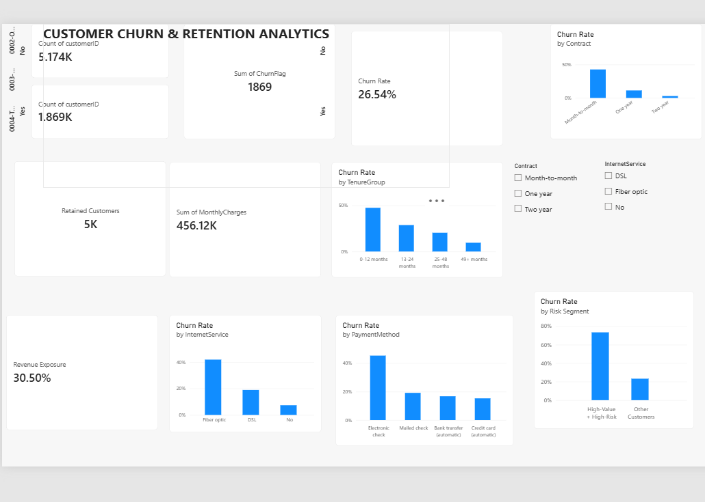

# Customer Churn & Retention Analytics

An end-to-end data analytics project that analyzes customer churn patterns, identifies high-risk customer segments, and provides business insights for customer retention.

## Project Overview

Customer churn is a major challenge for subscription-based businesses. This project analyzes telecom customer data to understand:

- Which customer segments have higher observed churn rates?
- How does churn vary by contract type and tenure?
- Which internet service and payment methods are associated with higher churn?
- Which customers represent a high-value and high-risk segment?
- What retention opportunities can be identified from the data?

The project follows a complete analytics workflow from data cleaning and SQL analysis to Python exploratory analysis and Power BI visualization.

## Business Objective

The objective is to identify customer segments with higher observed churn and provide data-driven insights that can help businesses prioritize retention analysis and customer engagement initiatives.

## Tools & Technologies

- Python
- Pandas
- NumPy
- Matplotlib
- MySQL
- SQL
- Power BI
- Git & GitHub

## Project Workflow

Raw Data
→ Data Cleaning
→ MySQL Database
→ SQL Analysis
→ Python EDA
→ Power BI Dashboard
→ Business Insights

## Dataset

The project uses the IBM Telco Customer Churn dataset containing 7,043 telecom customers and 21 original attributes.

The dataset includes customer demographics, tenure, contract information, internet services, payment methods, monthly charges, total charges, and churn status.

## Key Findings

- Overall observed churn rate: **26.54%**
- Churned customers: **1,869**
- Customers with month-to-month contracts have an observed churn rate of **42.71%**
- Customers with 0–12 months tenure have an observed churn rate of **47.44%**
- Fiber optic customers have an observed churn rate of **41.89%**
- Electronic check users have an observed churn rate of **45.29%**
- A defined high-value + high-risk segment contains **468 customers**
- This high-value + high-risk segment has an observed churn rate of **73.29%**

## High-Value + High-Risk Segment

For this project, a customer is classified as high-value + high-risk when:

- Monthly charges >= 80
- Contract = Month-to-month
- Tenure <= 12 months

This segment contains **468 customers**, of which **343 are churned**, resulting in an observed churn rate of **73.29%**.

The segment is used to identify customers that may warrant further retention analysis.

## Power BI Dashboard

The dashboard provides an interactive view of:

- Overall churn KPIs
- Churn by contract type
- Churn by tenure
- Churn by internet service
- Churn by payment method
- High-value + high-risk customers
- Contract and internet service filters



## Project Structure

```text
Customer Churn & Retention Analytics/
│
├── data/
│   ├── raw/
│   └── cleaned/
│
├── docs/
│   ├── business-problem.md
│   └── insights.md
│
├── images/
│   └── powerbi-dashboard.png
│
├── powerbi/
│
├── python/
│   ├── data_cleaning.py
│   ├── eda.py
│   └── load_to_mysql.py
│
├── sql/
│   ├── 01_overall_churn.sql
│   ├── 02_customer_segments.sql
│   └── 03_revenue_analysis.sql
│
├── .env.example
├── .gitignore
├── README.md
└── requirements.txt